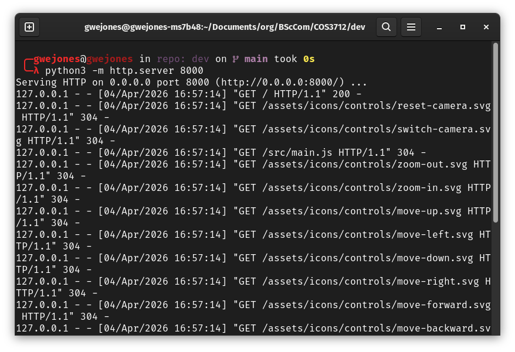
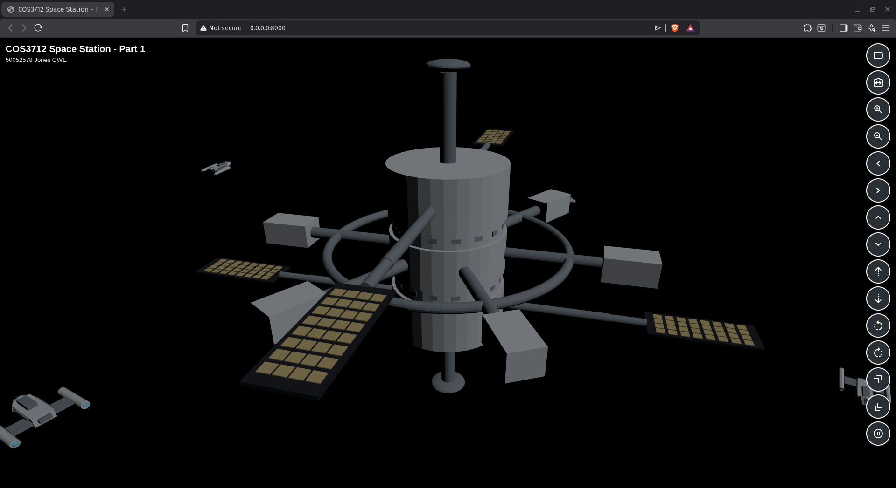

# COS3712 Interactive 3D Space Station (Part 1)

Student: 50052578 Jones GWE

This repository contains Assessment 2, Part 1 for COS3712: an interactive 3D space station built with Three.js and Blender assets.

## Objectives

- Build a 3D space station using primitives.
- Animate spacecraft and rotating components.
- Implement full camera navigation.
- Use perspective projection.

## Project Scope

Part 1 implementation includes:

- Space station model built from primitive-based Blender geometry
- Multiple orbiting spacecraft with continuous animation
- Perspective camera with free movement controls
- First-person ship camera view cycling
- Smooth camera transitions (position, orientation, and FOV interpolation)

## Technical Stack

- JavaScript (ES modules)
- Three.js v0.183.2
- Blender for modeling and `.glb` export

## Run Locally

Do not open `index.html` directly via `file://...`, because this project uses JavaScript ES modules and browser security rules block module/import-map loading reliably from local file URLs.

From the repository root:

```bash
python3 -m http.server 8000
```

Open:

- `http://localhost:8000/`

## Control Guide

Controls are rendered as a right-side vertical overlay in `index.html`.

| Control | Action | Available In |
| --- | --- | --- |
| `Reset Camera` | Returns to default external view | Free + FP |
| `Switch Camera` | Cycles: free view -> ship 1 FP -> ship 2 FP -> ... -> free view | Free + FP |
| `Zoom In`, `Zoom Out` | Changes camera FOV (zoom behavior) | Free view only |
| `Move Left`, `Move Right` | Lateral camera movement | Free view only |
| `Move Up`, `Move Down` | Vertical camera movement | Free view only |
| `Move Forward`, `Move Backward` | Longitudinal camera movement | Free view only |
| `Pan Left`, `Pan Right` | Yaw camera | Free view only |
| `Tilt Up`, `Tilt Down` | Pitch camera | Free view only |
| `Pause Orbit` / `Resume Orbit` | Pause/resume ship orbits | Free + FP |

## Camera Behavior Notes

- Free camera and first-person camera are separate view states.
- First-person orientation is aligned to ship travel direction with axis correction for camera forward (`-Z`) vs object forward (`+Z`).
- When returning to free view, prior free-view camera state is restored.

## Documentation Evidence

To verify all required functionailty, see the deployed live project at https://gwejones.github.io/cos3712-assignments/.

### Proof of successful local run / compilation context

#### Page hosting

This project does not require compilation, as it is written in plain Javascript. The project was successfully hosted locally using the `http.server` Python module.



#### Page rendering in browser

After hosting, the site could be opened in a web broswer and rendered properly.



### Proof of camera controls and working animations

See accompanying video `camera_and_animation.mp4`.

## Third-Party Assets and Licenses

- Three.js: MIT License
- Google Material Symbols SVG icons used for controls: Apache License 2.0
  - Source: `https://fonts.google.com/icons`
  - License reference: `https://www.apache.org/licenses/LICENSE-2.0`
  - Local icon mapping and references: `assets/icons/controls/README.md`

## Export This README to PDF

This section generates a PDF from `README.md`.

### Prerequisites

Install:

- `pandoc`
- `texlive`

### Generate PDF

From repository root:

```bash
pandoc README.md \
  --from gfm \
  --number-sections \
  --standalone \
  -V papersize:a4 \
  -V geometry:margin=15mm \
  -o docs/COS3712_Part1_Documentation.pdf
```

## Deployment

This project is structured for GitHub Pages:

- Publish from `main` branch
- Folder: repository root (`/`)
- Live URL: `https://gwejones.github.io/cos3712-assignments/`

## Repository Structure

- `index.html` - application entry point
- `src/` - Three.js runtime logic
- `assets/models/` - runtime GLB models
- `assets/blender/` - Blender source files
- `assets/icons/controls/` - control SVG icons and icon license notes
- `docs/` - project documentation and report output

## Academic Integrity

This project was individually produced. The full commit history can be found here: https://github.com/gwejones/cos3712-assignments/commits/main/.
