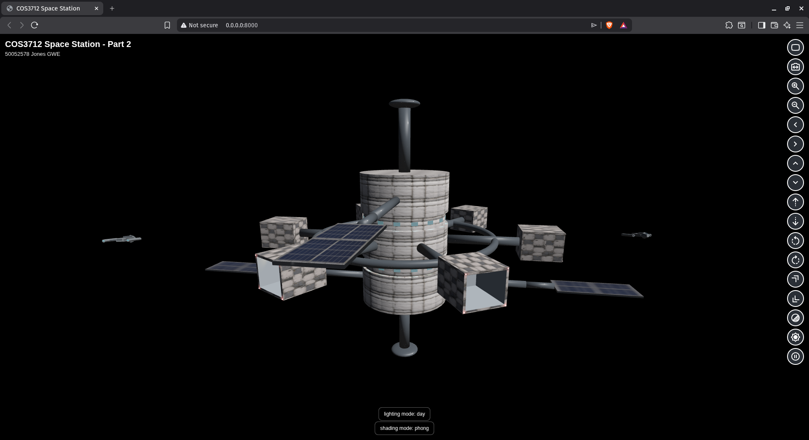
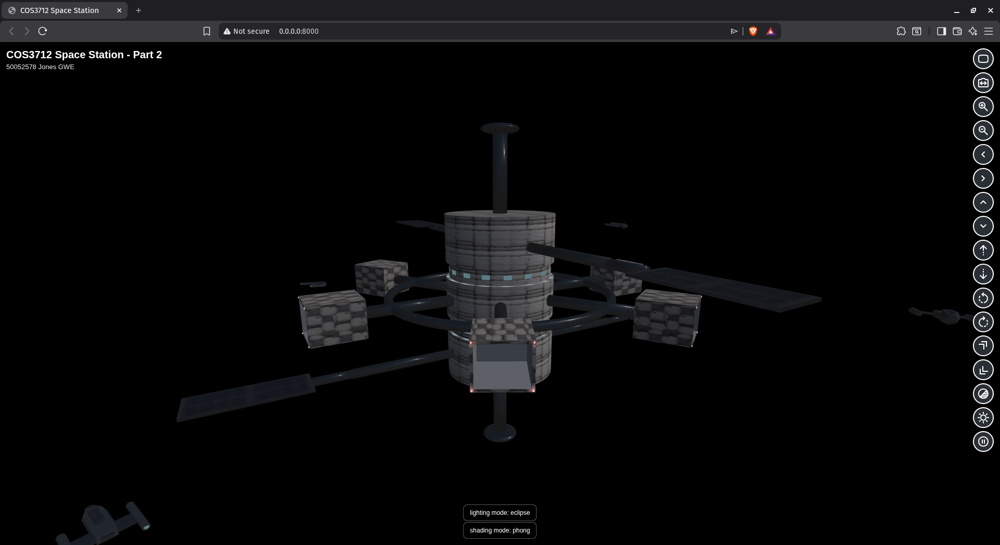
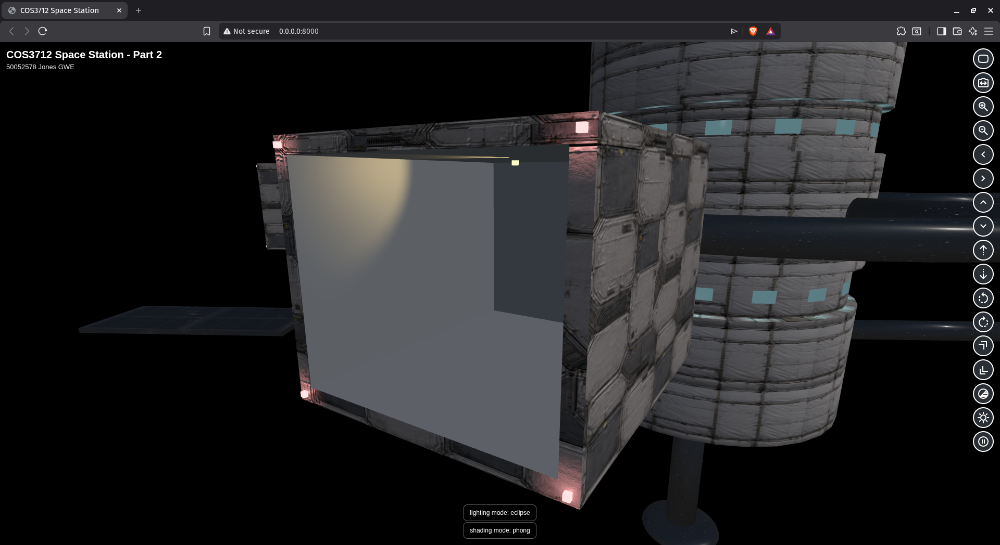
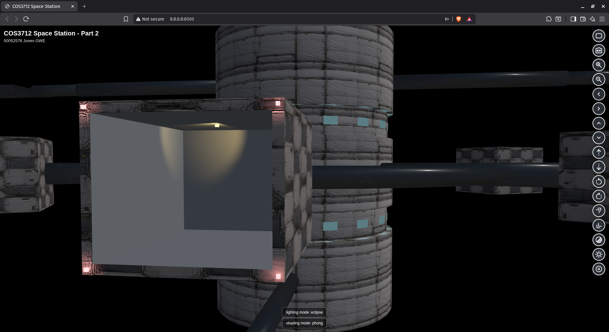
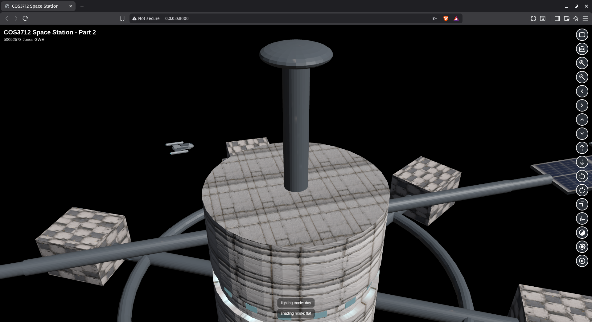
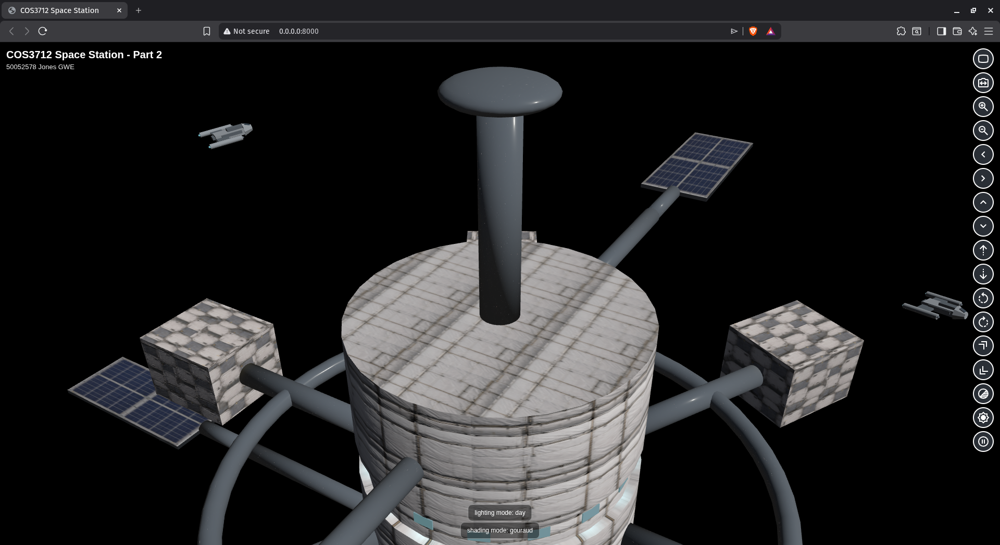
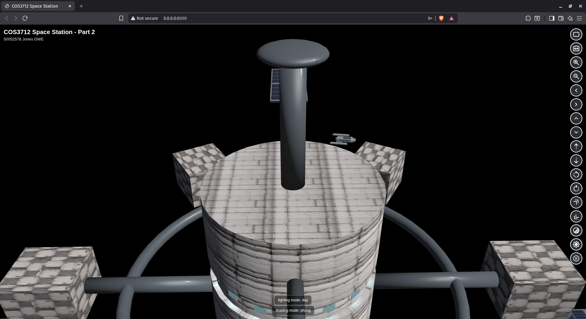
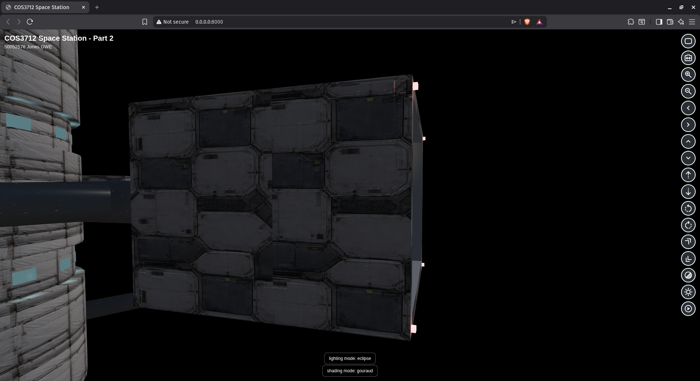
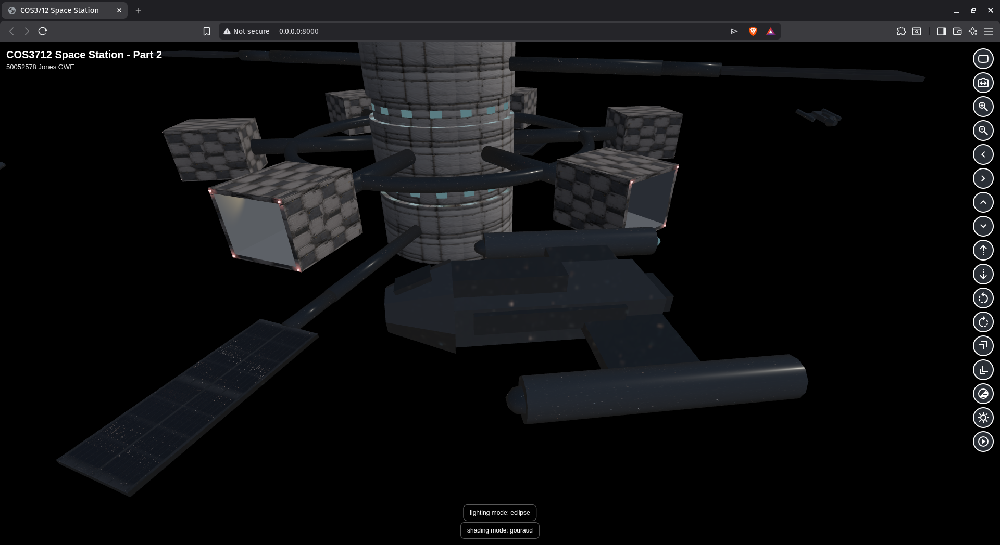
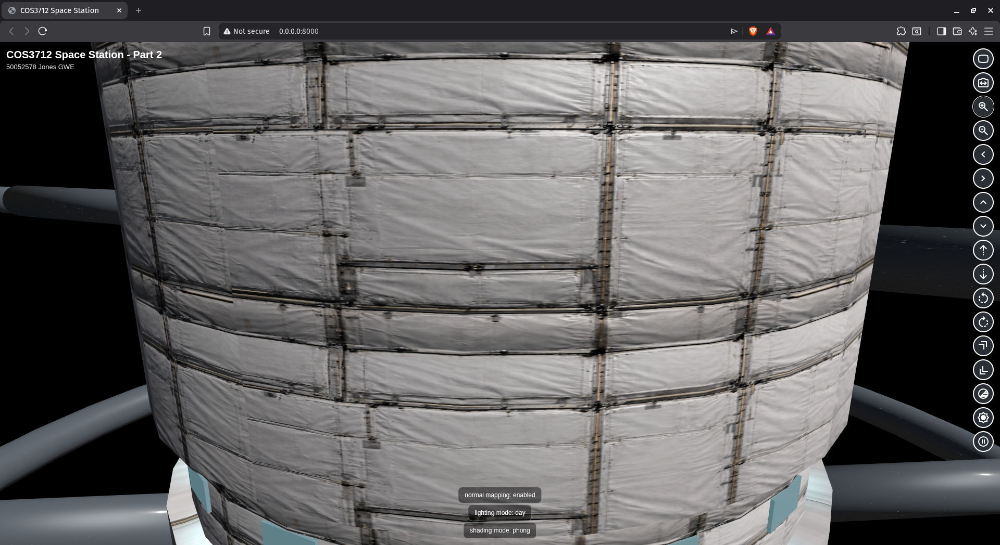

# COS3712 Interactive 3D Space Station (Part 1 + Part 2)

Student: 50052578 Jones GWE

This repository contains COS3712 Assessment 4 work: an interactive 3D space station built with Three.js and Blender assets.

See the live site deployed at [https://gwejones.github.io/cos3712-assignments/](https://gwejones.github.io/cos3712-assignments/).

## Objectives

- Build a 3D space station using primitives.
- Animate spacecraft and rotating components.
- Implement full camera navigation.
- Use perspective projection.

## Project Scope

Part 1 implementation includes:

- Space station model built from primitive-based Blender geometry
- Multiple orbiting spacecraft with continuous animation
- Perspective camera with free movement controls
- First-person ship camera view cycling
- Smooth camera transitions (position, orientation, and FOV interpolation)

## Part 2 Scope

Part 2 implementation focuses on:

- Advanced lighting (directional, point, and spotlight usage)
- Shading model comparison (Flat, Gouraud, and Phong)
- Surface-detail mapping (texture, environment, and normal mapping)

## Technical Stack

- JavaScript (ES modules)
- Three.js v0.183.2
- Blender for modeling and `.glb` export

## Run Locally

Do not open `index.html` directly via `file://...`, because this project uses JavaScript ES modules and browser security rules block module/import-map loading reliably from local file URLs.

From the repository root:

```bash
python3 -m http.server 8000
```

Open:

- `http://localhost:8000/`

## Control Guide

Controls are rendered as a right-side vertical overlay in `index.html`.

| Icon(s) | Action | Available In |
| --- | --- | --- |
|  | Returns to default external view | Free + FP |
|  | Cycles: free view -> ship 1 FP -> ship 2 FP -> ... -> free view | Free + FP |
|   | Changes camera FOV (zoom behavior) | Free view only |
|   | Lateral camera movement | Free view only |
|   | Vertical camera movement | Free view only |
|   | Longitudinal camera movement | Free view only |
|   | Yaw camera | Free view only |
|   | Pitch camera | Free view only |
|  | Cycles shading mode: assigned -> flat -> gouraud -> phong | Free + FP |
|   | Toggles directional sunlight mode: day -> eclipse -> day | Free + FP |
|   | Pause/resume ship orbits | Free + FP |

## Camera Behavior Notes

- Free camera and first-person camera are separate view states.
- First-person orientation is aligned to ship travel direction with axis correction for camera forward (`-Z`) vs object forward (`+Z`).
- When returning to free view, prior free-view camera state is restored.

## Lighting Techniques

Lighting is implemented using one runtime-configured directional light plus punctual lights authored in Blender and imported through `station.glb` (`KHR_lights_punctual`).

### Directional Light (Sun)

- Three.js type: `THREE.DirectionalLight`
- Where used: global scene light (`sun` in `src/main.js`)
- Purpose: simulates sunlight for broad illumination and specular response across station and ships
- Toggle behavior: `day` and `eclipse` modes are switched by the lighting-mode control button





### Point Lights

- Three.js type: `THREE.PointLight` (from GLB)
- Where used:
  - station core window bands (`core_window_point_b*`, 32 instances)
  - docking-bay outer-face corner markers (`dock_corner_point_b*_c*`, 24 instances)
- Purpose:
  - local window glow around the cylindrical core
  - red navigation marker lighting around docking entrances



### Spotlights (Docking Guidance)

- Three.js type: `THREE.SpotLight` (from GLB)
- Where used: docking beacon units (`dock_beacon_spot_b*`, 6 instances)
- Purpose: directional guidance beams for docking bays
- Animated at runtime by updating each spotlight target.



## Shading Techniques

Shading assignment is static and resolved from object-name prefixes in the scene graph. If a parent matches a prefix, that technique cascades to all children in that subtree.

### Technique-to-Part Mapping

| Prefix / Part Group | Shading Technique | Three.js Material |
| --- | --- | --- |
| `cargo_*` | Flat | `THREE.MeshPhongMaterial` with `flatShading = true` |
| `mid_*` | Gouraud | `THREE.MeshLambertMaterial` |
| `core_*` | Phong | `THREE.MeshPhongMaterial` with `flatShading = false` |
| `ship_*` | Phong | `THREE.MeshPhongMaterial` with `flatShading = false` |

### Visible Differences Between Shading Techniques

Visible differences are demonstrated from a single fixed overhead station view. During comparison, camera position/orientation and lighting are kept constant, and only the shading mode is changed using the Shading Mode control (`assigned -> flat -> gouraud -> phong`).

#### Flat

- Principle operation: lighting is evaluated per face using a single geometric surface direction per triangle.
- Normal processing: one face normal is used across the entire triangle (no smooth interpolation between vertices).
- Expected visible result: clear faceting and abrupt brightness changes at polygon boundaries.



#### Gouraud

- Principle operation: lighting is evaluated at vertices, then vertex lighting values are interpolated across each triangle.
- Normal processing: vertex normals are used for the vertex-light calculations, and the resulting lit color is interpolated per pixel.
- Expected visible result: smoother surfaces than flat shading, but highlight/detail definition is softer because lighting itself is not recomputed per pixel.



#### Phong

- Principle operation: normals are interpolated per pixel and lighting is evaluated per pixel.
- Normal processing: vertex normals are interpolated over the triangle to produce a per-fragment normal for the lighting equations.
- Expected visible result: smoothest shading transitions and the clearest specular highlight definition, especially on curved metallic surfaces.



## Mapping Techniques

We use texture mapping, environment mapping, and normal mapping.

### Texture Mapping

- Technique: UV-based image texture mapping (albedo/base-color textures)
- Where used:
  - Station core exterior panel/wall surfaces (`core_*`)
  - Docking-bay walls and docking platform faces (`cargo_*`, selected docking meshes)
  - Solar panel surfaces (`mid_solar_panels`)
- Runtime material usage in Three.js:
  - `MeshLambertMaterial.map` (Gouraud group)
  - `MeshPhongMaterial.map` (Flat/Phong groups)
- Textures are authored in Blender and exported through GLB material textures.



### Environment Mapping

- Technique: HDR environment mapping using a space EXR panorama
- Where used:
  - Mid-level reflective station structures (`mid_*`)
  - Core window band structure (`core_band_windows`)
  - Ship reflective surfaces (`ship_*`)
- Runtime material usage in Three.js:
  - Environment texture loaded via `EXRLoader`
  - Applied as `scene.environment`
  - Applied per remapped mesh as `MeshPhongMaterial.envMap` / `MeshLambertMaterial.envMap`
  - Reflectivity controlled by object-name prefix in `src/main.js`



### Normal Mapping

- Technique: tangent-space normal mapping for fine surface relief
- Where used:
  - Station core shell (`core_main`)
  - Docking module surfaces (`cargo_docks`)
  - Solar panel surfaces (`mid_solar_panels`)
- Runtime material usage in Three.js:
  - `MeshLambertMaterial.normalMap`
  - `MeshPhongMaterial.normalMap`
- Normal maps add lighting detail without adding geometry complexity.
- Current exported GLBs do not include normal maps on ship materials.



## Third-Party Assets and Licenses

- Three.js: MIT License
- HDR environment texture (`assets/textures/env/night_sky_hdri_1k.exr`): ambientCG `NightSkyHDRI003`, CC0
  - Source: `https://ambientcg.com/view?id=NightSkyHDRI003`
- Google Material Symbols SVG icons used for controls: Apache License 2.0
  - Source: `https://fonts.google.com/icons`
  - License reference: `https://www.apache.org/licenses/LICENSE-2.0`
  - Local icon mapping and references: `assets/icons/controls/README.md`

## Export This README to PDF

This section generates a PDF from `README.md`.

### Prerequisites

Install:

- `pandoc`
- `texlive`

### Generate PDF

From repository root:

```bash
pandoc README.md \
  --from gfm \
  --number-sections \
  --standalone \
  -V papersize:a4 \
  -V geometry:margin=15mm \
  -o docs/COS3712_Part2_Documentation.pdf
```

## Deployment

This project is structured for GitHub Pages:

- Publish from `main` branch
- Folder: repository root (`/`)
- Live URL: [https://gwejones.github.io/cos3712-assignments/](https://gwejones.github.io/cos3712-assignments/)

## Repository Structure

- `index.html` - application entry point
- `src/` - Three.js runtime logic
- `assets/models/` - runtime GLB models
- `assets/blender/` - Blender source files
- `assets/icons/controls/` - control SVG icons and icon license notes
- `docs/` - project documentation and report output

## Academic Integrity

This project was individually produced. The repository can be found here: [https://github.com/gwejones/cos3712-assignments/](https://github.com/gwejones/cos3712-assignments/).
